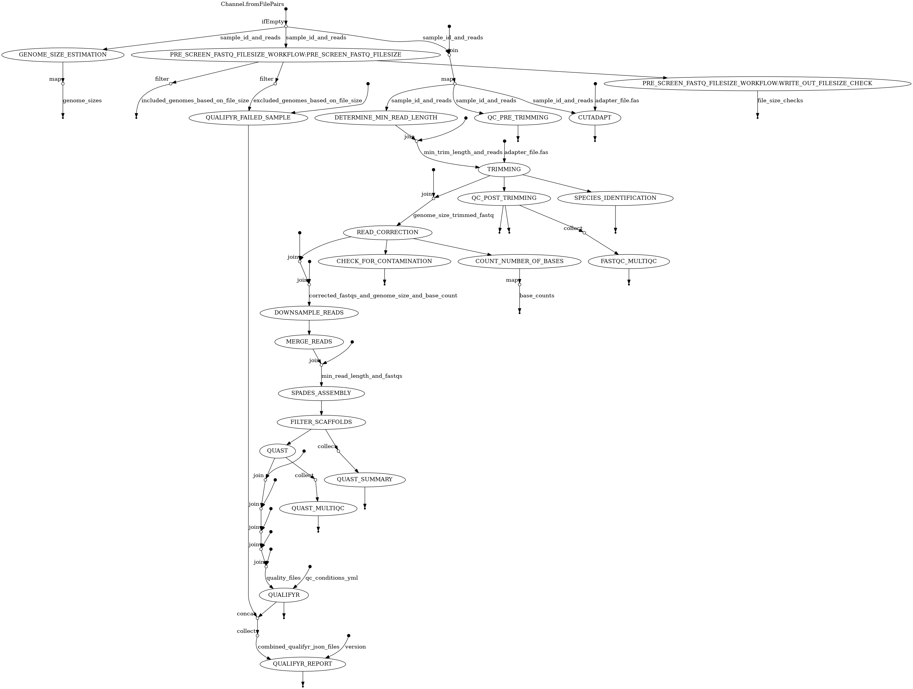

# GHRU SPAdes Assembly workflow
This [Nextflow](https://www.nextflow.io/) workflow can be used to process short read fastq files an assembly pipeline using the [SPAdes assembler](http://cab.spbu.ru/software/spades/). Alongside this it will QC the reads before and after trimming and QC the final assembled scaffolds file using [Quast](http://quast.sourceforge.net/quast).
The pipeline was based on Shovill (Thanks to Torsten Seemann @torstenseemann): https://github.com/tseemann/shovill

### Authors
Anthony Underwood @bioinformant <au3@sanger.ac.uk>  
Varun Shammana  
Ayorinde Afolayan  
Erkison Odih  
Angela Sofia Garcia  
Felipe Delgadillo Barrera  
Oscar Gabriel Beltran  
Johan Fabian Bernal  

## Instructions
The dependencies are provided in a Docker image
```
docker pull registry.gitlab.com/cgps/ghru/pipelines/dsl2/pipelines/assembly:latest
```

Typically the workflow should be run as follows
```
nextflow run assembly.nf [options] -resume 
```
To run the test sets either of the following commands will work
 - Using paired end reads and no down sampling
    ```
    nextflow run assembly.nf --input_dir test_input --output_dir test_output --fastq_pattern "*{R,_}{1,2}*.fastq.gz" --adapter_file adapters.fas --qc_conditions qc_conditions_nextera_relaxed.yml 
    ```
 -  Using single end reads ato a depth cutofff of 50
    ```
    nextflow run assembly.nf  --input_dir test_input --output_dir test_output --fastq_pattern "*{R,_}*.fastq.gz" --adapter_file adapters.fas --qc_conditions qc_conditions_nextera_relaxed.yml --depth_cutoff 50 --single_end -resume
    ```

The mandatory options that should be supplied are
  - A source of the fastq files specified as either of the following
    - local files on disk using the `--input_dir` and `--fastq_pattern` arguments
  - The output from the pipeline will be written to the directory specified by the `--output_dir` argument
  - The path to a fasta file containing adapter sequences to trim from reads specified by the `--adapter_sequences` argument

Optional arguments include
  - `--depth_cutoff` argument. Downsample each sample to an approximate depth of the value supplied e.g 50 means downsample to 50x depth of coverage . If not specified no downsampling will occur
  - `--careful` Turn on the SPAdes careful option which improves assembly by mapping the reads back to the contigs
  - `--minimum_scaffold_length` The minimum length of a scaffold to keep. Others will be filtered out. Default 500 
  - `--minimum_scaffold_depth` The minimum depth of coverage a scaffold must have in order to be kept. Others will be filtered out. Default 3 
  - `--confindr_db_path` The path to the confindr database. If not set assumes use of the Docker image where the path is '/confindr_database'
  - `--qc_conditions` Path to a YAML file containing pass/warning/fail conditions used by [QualiFyr](https://gitlab.com/cgps/qualifyr). An example of the format can be seen [here](qc_conditions.yml) and [another](qc_conditions_nextera_relaxed.yml)  more suitable for reads generated from a Nextera library preparation
  - `--prescreen_genome_size_check` Size in bp of the maximum estimated genome to assemble. Without this any size genome assembly will be attempted
  - `--prescreen_file_size_check` Minumum size in Mb for the input fastq files. Without this any size of file will be attempted (this and prescreen_genome_size_check are mutually exclusive)
  - `--full_output` Output pre_trimming fastqc reports, merged_fastqs and corrected_fastqs. These take up signficant disk space and so are not copied to the output_dir by default

## Workflow process
The workflow consists of the following steps

1. QC reads using FastQC before trimming
2. Trim reads using trimmomatic (dynamic MIN_LEN based on 30% of the read length)
3. QC reads using FastQC after trimming
4. Correct reads using lighter
5. Check for contamination using [confindr](https://lowandrew.github.io/ConFindr/)
6. Count number of reads and estimate genome size using Mash
7. Downsample reads if the `--depth_cutoff` argument was specified
8. Merge reads using Flash where the insert size is small
9. Assemble reads using SPAdes (by default the --careful option is turned **off**)
10. Assess species identification using [bactinspector](https://gitlab.com/antunderwood/bactinspector)
11. Assess assembly quality using Quast
12. Sumarise all assembly QCs using Quast
13. (Optional if [QuailFyr](https://gitlab.com/cgps/qualifyr) qc conditions YAML file is supplied). Filter assemblies into three directories: pass, warning and failure based on QC  metrics

A sumamry of this process is shown below in the diagram that was generated when running Nextflow using the -with-dag command



## Workflow outputs
These will be found in the directory specified by the `--output_dir` argument

  - A directory called `fastqc/post_trimming` that contans the Fastqc reports for each fastq in html format after trimming
  - A directory called `assemblies` containing the final assembled scaffold files named as `<SAMPLE NAME>_scaffolds.fasta`. If the qc_conditions argument was given there will be subdirectories named pass, warning and failure where the appropiately QCed scaffolds and failure reasons will be stored.
  - A directory called `quast` containing
    - A summary quast report named `combined_quast_report.tsv`
    - A transposed summary quast report with the samples as rows so that they can be sorted based on the quast metric in columns named `combined_quast_report.tsv`
  - A directory called `quality_reports` containing html reports
    - [MultiQC](https://multiqc.info/) summary reports combining QC results for all samples from
      - FastQC: fastqc_multiqc_report.html
      - Quast: quast_multiqc_report.html
    - QualiFyr reports. If a qc_conditions.yml file was supplied reports will be generated that contain a summary of the overall pass/fail status of each sample.
      - qualifyr_report.html : e.g [QualiFyr Report](https://glcdn.githack.com/cgps/ghru/pipelines/dsl2/pipelines/assembly/-/raw/develop/README_files/example_qualifyr_report.html)
      - qualifyr_report.tsv
  - if the `--full_output` parameter is given then the following will also be available in the output directory
    - A directory called `fastqc/pre_trimming` that contans the Fastqc reports for each fastq in html format prior to trimming
    - A directory called `corrected_fastqs` that contains the fastq files that have been trimmed with Trimmomatic and corrected using Lighter
    - If using paired end reads, a directory called `merged_fastqs` that contains the fastq files that have been merged using Flash. There will be a files called
      - `<SAMPLE NAME>.extendedFrags.fastq.gz` merged reads
      - `<SAMPLE NAME>.notCombined_1.fastq.gz` unmerged read 1 reads
      - `<SAMPLE NAME>.notCombined_2.fastq.gz` unmerged read 2 reads

## Software used within the workflow
  - [FastQC](https://www.bioinformatics.babraham.ac.uk/projects/fastqc/) A quality control tool for high throughput sequence data.
  - [Trimmomatic](http://www.usadellab.org/cms/?page=trimmomatic) A flexible read trimming tool for Illumina NGS data.
  - [mash](https://mash.readthedocs.io/en/latest/) Fast genome and metagenome distance estimation using MinHash.
  - [lighter](https://github.com/mourisl/Lighter) Fast and memory-efficient sequencing error corrector.
  - [seqtk](https://github.com/lh3/seqtk) A fast and lightweight tool for processing sequences in the FASTA or FASTQ format.
  - [FLASH](https://ccb.jhu.edu/software/FLASH/) (Fast Length Adjustment of SHort reads) A very fast and accurate software tool to merge paired-end reads from next-generation sequencing experiments.
  - [SPAdes](http://cab.spbu.ru/software/spades/) A genome assembly algorithm designed for single cell and multi-cells bacterial data sets.
  - [contig-tools](https://pypi.org/project/contig-tools/) A utility Python package to parse multi fasta files resulting from de novo assembly.
  - [Quast](http://quast.sourceforge.net/quast) A tool to evaluate the aulaity of genome assemblies.
  - [ConFindr](https://lowandrew.github.io/ConFindr/) Software that can detect contamination in bacterial NGS data, both between and within species.
  - [QualiFyr](https://gitlab.com/cgps/qualifyr) Software to give an overall QC status for a sample based on multiple QC metric files
  - [MultiQC](https://multiqc.info/) Aggregate results from bioinformatics analyses across many samples into a single report
  - [KAT](https://github.com/TGAC/KAT) The K-mer Analysis Toolkit (KAT) contains a number of tools that analyse and compare K-mer spectra
  - [BactInspector](https://gitlab.com/antunderwood/bactinspector) Software using an updated refseq mash database to predict species

### Test that the pipeline and Docker dependency is installed correctly

Test command for paired end reads
```
nextflow run main.nf --input_dir small_test_input --output_dir test_output --fastq_pattern '*{R,_}{1,2}.fastq.gz' --adapter_file adapters.fas  --full_output --cutadapt -resume
```

Test command for single end reads
```
nextflow run main.nf --input_dir small_test_input --output_dir test_output --fastq_pattern '*{R,_}1.fastq.gz' --adapter_file adapters.fas  --full_output  --cutadapt --single_read -resume
```